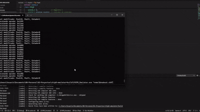

# Emulador CHIP-8
  

Este proyecto es un **emulador del sistema CHIP-8** desarrollado en C++ utilizando la biblioteca SDL2 en sistema operativo Windows. El CHIP-8 es una máquina virtual simple que se utilizaba para videojuegos en los años 70.

<p align="center">
  
</p>

El objetivo de este proyecto es aprender cómo funcionan los emuladores básicos y explorar temas clave como operaciones con bits, desplazamientos, registros y optimización de memoria.

Este emulador ha sido probado con los tests del repositorio de [Timendus](https://github.com/Timendus/chip8-test-suite), lo que ayudó a encontrar y corregir errores.

(El temporizador de sonido está implementado, pero aún no tiene un efecto personalizado. Esto se considera una mejora futura.)

## Características 🌟

- **Compatibilidad completa** con las instrucciones del CHIP-8.
- Renderizado escalado con SDL2.
- Soporte para entrada del teclado mapeado a las teclas originales del CHIP-8.
- Implementación de temporizadores de sonido y retraso.
- Ejecución de ROMs de juegos clásicos de CHIP-8.

## Requisitos 🛠️

Antes de comenzar, asegúrate de tener lo siguiente instalado:

- **C++11** (o superior).
- **CMake 3.10+**
- **SDL2** (debe estar configurado en `C:/SDL2` o ajustar el archivo `CMakeLists.txt` si está en otra ubicación).
- **MinGW64** (para compilación en Windows).

## Instalación 📥

1. Clona este repositorio:

   ```bash
   git clone https://github.com/Pablo-barquin/chip8-emulator.git
   cd emulador-chip8
   ```

2. Configura el entorno de compilación:

   ```bash
   mkdir build && cd build
   cmake ..
   ```

3. Compila el emulador:

   ```bash
   cmake --build .
   ```

## Uso 🎮

Ejecuta el emulador proporcionando una ROM como argumento:

```bash
CHIP8_Emulator.exe <ruta_a_la_rom>
```

Las teclas del teclado se mapean a las teclas originales del CHIP-8 de la siguiente manera:

<p align="center">
  
</p>

## Estructura del Proyecto 🗂️

```
/
|-- src/               # Archivos fuente principales
|-- assets/            # Se encuentra el .gif de muestra
|-- roms/              # Roms de ejemplo para probar el emulador
|-- include/           # Archivos de cabecera
|-- CMakeLists.txt     # Archivo de configuración para CMake
|-- .gitignore         # Evita la subida de ficheros innecesarios al repositorio
|-- README.md          # Descripción del proyecto
```

## Contribución 🤝

1. Haz un fork del repositorio.
2. Crea una nueva rama:

   ```bash
   git checkout -b feature/nueva-funcionalidad
   ```

3. Realiza tus cambios y haz commit:

   ```bash
   git commit -m "Agrega nueva funcionalidad"
   ```

4. Envía un pull request.

## Recursos Adicionales 🌐

- [Documentación de CHIP-8](https://en.wikipedia.org/wiki/CHIP-8)
- [SDL2](https://www.libsdl.org/)

